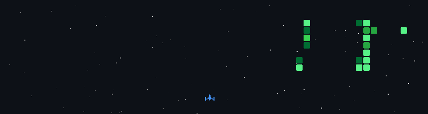

<h1 align="center">
  Hi 👋, I'm Thitipong Saysood
</h1>

<h3 align="center">
  Graphic Designer & Developer
</h3>

  Creative Designer who loves technology, development and building useful digital experiences.

---

## 👨‍💻 About Me

- 🌍 Based in Bangkok, Thailand
- 🖥️ Portfolio: http://support.nineplus.co.th/portfolio
- ✉️ Email: arm.thitipong1994@gmail.com
- 🧠 Currently learning React.js, Next.js, PHP & TypeScript
- 🎨 Graphic Designer × Developer

> Delete negativity. Return positivity.

---

## 🛠️ Tech Stack

  

---

## 🎨 Design & Creative Tools

  

---

## 💻 Platforms

  

---

## 🌐 Connect With Me

  

  

  

---

## 📊 GitHub Activity

  

---

## 📈 Development Metrics

<table>
  <tr>
    <td width="50%" align="center">
      <h3>📅 Isometric Commit Calendar</h3>
    </td>
    <td width="50%" align="center">
      <h3>🈷️ Languages Activity</h3>
    </td>
  </tr>

  <tr>
    <td width="50%" valign="top">
      
    </td>

    <td width="50%" valign="top">
      
    </td>
  </tr>
</table>

  <i>My development activity & programming language statistics</i>

## 🚀 GitHub Space Shooter

  

  <i>My GitHub contributions turned into a space battle 🚀</i>

---

## 🧰 Main Skills

---

## 🎯 Focus

  UI / UX Design • Web Development • Automation • Creative Technology

---

  <b>Graphic Design × Development × Technology</b>

  Designed & Built by Thitipong Saysood

